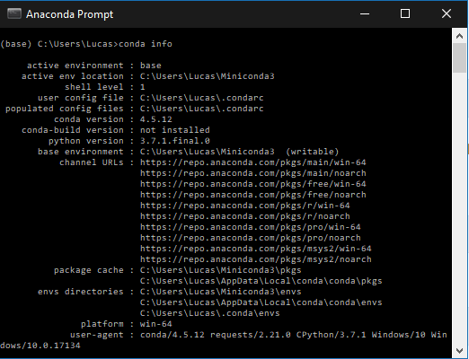
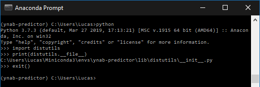

I recently decided to look at my past purchases, and see if I could leverage that data to predict some of my personal spending trends.

To help create a forecast, I settled on [Prophet](https://facebook.github.io/prophet/), which is a Python library for time series prediction from Facebook.

Let's get to the installation steps.

## Installing Python

Since some of the dependencies for Prophet require Numpy, we're going to install the [Anaconda distribution](https://www.anaconda.com/distribution/), since it comes with Numpy included. If you're looking for a more light-weight distribution, try [Miniconda](https://docs.conda.io/en/latest/miniconda.html), which is the same as Anaconda but without the default packages included.

After running the installer, verify that the conda package manager is installed by launching the Anaconda prompt and running `conda info`, which will list your Python version and env location.



### Optional - Creating a virtual environment

Creating a new virtual environment for each project is a good practice to follow, since it allows you to have multiple versions of a package installed, thereby allowing you to satisfy the exact version required for each dependency.

Create a new environment by typing the following in the Anaconda prompt: `conda create --name myenv` where myenv is the name of your environment. When prompted, type <kbd>y</kbd> to proceed. Next, enter `conda activate myenv` to activate the environment.

## Installing the C++ Compiler

Some of the dependencies for Prophet, notably PyStan, require a C++ compiler to install. The recommended C++ toolchain is the MingW-w64 toolchain. To install the compiler toolchain, enter the following in the Anaconda prompt `conda install libpython m2w64-toolchain -c msys2` and then type <kbd>y</kbd> when prompted to download and install the required packages and dependencies.

This ensures that the msys2 version of MingW-w64 is installed.

Next, ensure that `libpython` successfully setup the `distutils.cfg` file in the lib/distutils folder of your Python installation. To locate the proper path, enter the following in the Anaconda navigator:

```python
python
>>> import distutils
>>> print(distutils.__file__)
>>> exit()
```



Navigate to the same folder containing the `__init__.py` file location given by the previous set of commands, and ensure that a `distutils.cfg` file exists there and contains the following lines.

```toml
[build]
compiler=mingw32
```

# Installing Prophet dependencies

Prophet's major dependency is PyStan, so we'll install the dependencies for PyStan first before installing Prophet. Pystan requires the MingW toolchain to be installed and configured through the previous steps.

Ensure that the latest versions of the PyStan dependencies are installed by running the following in the Anaconda prompt, and typing <kbd>y</kbd> when prompted.

`conda install numpy cython matplotlib scipy pandas -c conda-forge`

After the installation is complete, install PyStan using either `pip` or `conda` by running one of the following.

- Using pip `pip install pystan`
- Using conda `conda install -c conda-forge pystan`

Finally, install Propehet using either `pip` or `conda` by running one of the following.

- Using pip `pip install fbprophet`
- Using conda `conda install -c conda-forge fbprophet`

You can verify the installation by running the following in the Anaconda prompt:

```python
python
>>> import fbprophet
>>>
```

If after executing the import statement you get the Python prompt without any errors, you've successfully installed Prophet on Windows 10.

Now just launch your favourite IDE and configure it to use the Python installation or virtual environment we just configured, and you're all set. Now it's time to dive into the [Prophet Quick Start Guide](https://facebook.github.io/prophet/docs/quick_start.html#python-api).
