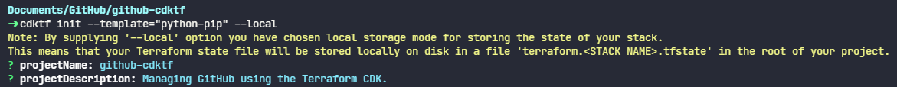
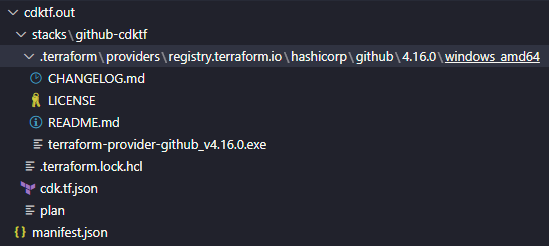
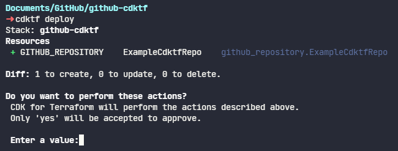
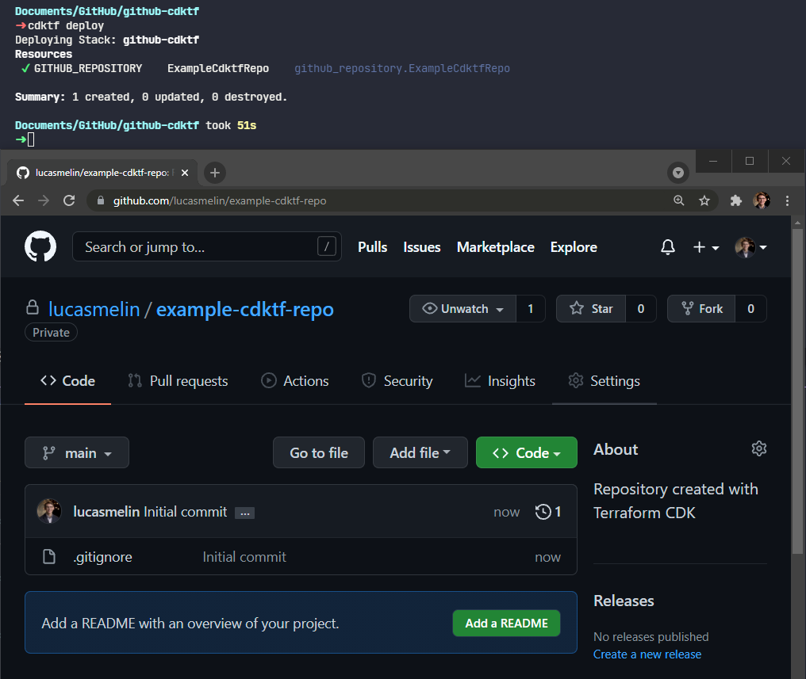
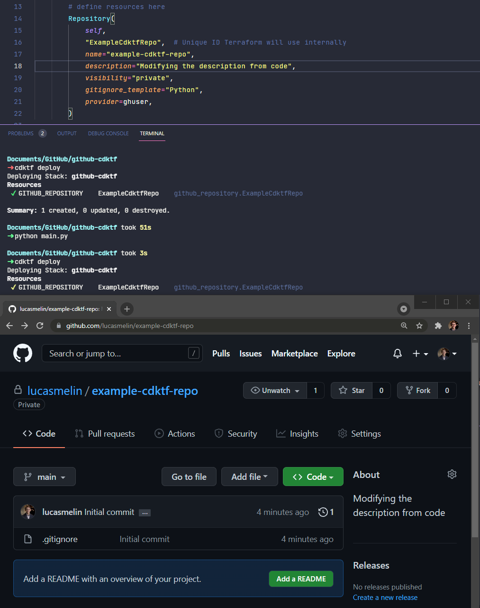

As you start using GitHub more and more, oftentimes there's configuration and policies that you'd like to consistently apply like branch protection rules or repo names, descriptions, visibility rules, etc. If you're managing a GitHub Organization, managing these through the UI can quickly become a lot of manual work.

Using infrastructure-as-code tools, we can automate a lot of this manual work and eliminate toil. Let's look at one way to do this using the [Terraform CDK (Cloud Development Kit)](https://github.com/hashicorp/terraform-cdk).

## Setting up our environment

The Terraform CDK has a few up-front requirements:

1. [NodeJS](https://nodejs.org/en/download/) - I used the latest LTS release, v14.18.0
2. [Python](https://www.python.org/downloads/) - I used v3.9.7
3. [The Terraform CLI](https://www.terraform.io/downloads.html) - I used the latest v1.0.8

If you have something like [scoop](https://scoop.sh/) installed, you can use that to install these tools with `scoop install nodejs python terraform`. Otherwise, manually run through the installers for Python and NodeJS. The Terraform CLI doesn't come with an installer - simply move it to a directory that is on your `PATH`.

Once the dependencies are installed, the Terraform CDK can be installed with `npm install -g cdktf-cli`.

## Creating our project

We can create a new project directory with `mkdir github-cdktf && cd github-cdktf`. Next, we'll create a new CDK project using the pip template by running `cdktf init --template="python-pip" --local`.



This creates a `requirements.txt` file containing the python packages to install, as well as a `main.py` that has some boilerplate code to define our CDK project. Install the packages with `pip install -r requirements.txt`

```python
#!/usr/bin/env python
from constructs import Construct
from cdktf import App, TerraformStack


class MyStack(TerraformStack):
    def __init__(self, scope: Construct, ns: str):
        super().__init__(scope, ns)

        # define resources here


app = App()
MyStack(app, "github-cdktf")

app.synth()
```

In order to interact with the GitHub API using our Terraform code, we need to install the [Terraform GitHub provider](https://github.com/integrations/terraform-provider-github). Edit the `cdktf.json` file and add the following line to the `"terraformProviders"` section - `"github@~> 4.0"`. Your `cdktf.json` file should look something like this:

```json
{
  "language": "python",
  "app": "python3 ./main.py",
  "projectId": "0da37e0b-0c87-4913-b2a0-33af56e476ca",
  "terraformProviders": ["github@~> 4.0"],
  "terraformModules": [],
  "codeMakerOutput": "imports",
  "context": {
    "excludeStackIdFromLogicalIds": "true",
    "allowSepCharsInLogicalIds": "true"
  }
}
```

Now run `cdktf get`. This will read through our `cdktf.json` file and download each provider we specified (in our case just the GitHub provider). Then, the CDK will generate Python code for each module and place them in the directory specified by the `codeMakerOutput` value.

After running `cdktf get`, you should see a new `imports/github` directory that contains `__init__.py` with some python code. In the next step, we'll use these functions and classes inside our `main.py` to interact with GitHub.

## Creating a repository using python code

Open up `main.py` and add imports for the GitHub Terraform provider and the Repository class:

```python
from imports.github import Repository, GithubProvider
```

Next, inside the `MyStack` class' `__init__` function, we can create instances of these classes. We'll start by defining a provider, which will tell Terraform what GitHub organization or user account to use. In the example below, substitute your _actual_ GitHub username or organization name for `ghuser`:

```python {hl_lines=["10-16"]}
#!/usr/bin/env python
from constructs import Construct
from cdktf import App, TerraformStack


class MyStack(TerraformStack):
    def __init__(self, scope: Construct, ns: str):
        super().__init__(scope, ns)

        # Expects GITHUB_TOKEN to be set
        ghuser = GithubProvider(
            self,
            "github",
            alias="github",
            owner="ghuser" # Substitute with your account
        )

app = App()
MyStack(app, "github-cdktf")

app.synth()
```

We could specify multiple `GitHubProvider`s if we wanted to manage more than one organization or account, but for now we'll keep things simple.

In order to access the account or organization we've defined, Terraform needs a GitHub token. Generate one at https://github.com/settings/tokens and then set the token to an environment variable named `GITHUB_TOKEN` so that Terraform can automatically pick it up and use it with `set GITHUB_TOKEN=thetokenyougotfromgithub`.

Next, we'll define a `Repository`. The `Repository` takes a `provider` parameter, so we'll pass in our previously defined `GitHubProvider`. Remember to substitute your _actual_ GitHub username or organization name for `ghuser`:

```python {hl_lines=["17-25"]}
#!/usr/bin/env python
from constructs import Construct
from cdktf import App, TerraformStack


class MyStack(TerraformStack):
    def __init__(self, scope: Construct, ns: str):
        super().__init__(scope, ns)

        # Expects GITHUB_TOKEN to be set
        ghuser = GithubProvider(
            self,
            "github",
            alias="github",
            owner="ghuser" # Substitute with your account
        )
        Repository(
            self,
            "ExampleCdktfRepo", # Unique ID Terraform will use internally
            name="example-cdktf-repo",
            description="Repository created with Terraform CDK",
            visibility="private",
            gitignore_template="Python",
            provider=ghuser,
        )

app = App()
MyStack(app, "github-cdktf")

app.synth()
```

Notice how using the CDK allows us to define values that previously we would've had to set manually in the GitHub Web UI, like the name of the repository, the description, which `.gitignore` template to use, etc. Since this is defined as code, we could also add unit tests to validate organization policies such as _"Are all repository names lowercase?"_ and _"Are only certain repositories publicly visible?"_. The Terraform GitHub provider has many other classes that can be used to manage teams, team repositories, branch protection rules, etc. See [the official GitHub provider docs](https://registry.terraform.io/providers/integrations/github/latest/docs) for more details.

At this point, your `main.py` file should look something like this:

```python
#!/usr/bin/env python
from constructs import Construct
from cdktf import App, TerraformStack
from imports.github import Repository, GithubProvider


class MyStack(TerraformStack):
    def __init__(self, scope: Construct, ns: str):
        super().__init__(scope, ns)

        # Expects GITHUB_TOKEN to be set
        ghuser = GithubProvider(
          self,
          "github",
          alias="github",
          owner="ghuser" # Substitute with your account
        )

        # define resources here
        Repository(
            self,
            "ExampleCdktfRepo", # Unique ID Terraform will use internally
            name="example-cdktf-repo",
            description="Repository created with Terraform CDK",
            visibility="private",
            gitignore_template="Python",
            provider=ghuser,
        )


app = App()
MyStack(app, "github-cdktf")

app.synth()
```

When we run this file using `python main.py`, the Terraform CDK will execute the code we wrote and generate a bunch of files that will be stored in `cdktf.out` describing what providers are being used, and the infrastructure as a whole that we're trying to define. This can then be used by the Terraform CLI or by the CDK to compare the infrastructure we want against the infrastructure we've described, and apply the changes.



Let's continue with the CDK and run `cdktf deploy`.



The CDK will give you an overview of what changes are going to be made to your account or organization. Typing `yes` will apply the changes and create the GitHub repository.



If you wanted to change something that was previously defined, such as the repository description, that's easy to accomplish - simply edit the relevant section in `main.py` and re-run `python main.py` and `cdktf deploy`.



You're now all set to use the Terraform CDK and Python to programatically manage your GitHub resources. For more information and examples, see the [Terraform CDK GitHub](https://github.com/hashicorp/terraform-cdk) repository or take a look at [Hashicorp\'s Terraform tutorials](https://learn.hashicorp.com/terraform).
