# Integrating Todoist and Discord using Windmill

I've been spending more time in [Discord](https://discord.com/) lately, and I've been wanting a way to see the status of my [Todoist](https://app.todoist.com/app/inbox) tasks directly in Discord. Since there currently isn’t a first-party integration for Todoist and Discord, let’s build our own using [Windmill](https://www.windmill.dev/) and webhooks. At the end of this example, we'll be able to see when new Todoist items are created or completed in Discord.

## Why Windmill?

The webhook data generated by Todoist doesn't match Discord’s expected input format, so we need something to modify the JSON payload received from Todoist before it can be sent to Discord. Windmill has a [generous free tier](https://www.windmill.dev/pricing) that supports 1000 triggers per month, and it saves us from having to create a server and host our own integration. That said, you could also expand upon the approach shown in the following example by building a small server and deploying the application to something like [Vercel](https://vercel.com), [Fly.io](https://fly.io/), a major cloud provider, or even your own machine if you prefer.

## Creating a Todoist app

To start, let's create a new Todoist application. Log in to your Todoist account, and in the **Settings**, navigate to [**Integrations > Developer > App Management**](https://app.todoist.com/app/settings/integrations/app-management). Click on the **Add new integration** button and give your app a name like **Discord Integration**, then click on the **Create App** button.

In your new Todoist app, scroll down to the **Webhooks** section and select the events that you want your integration to receive under the **Webhook Events** section. For this example, we'll chose `item:added` and `item:completed`.


We now have a Todoist bot configured, but we still need to add a `Callback URL` for the webhook before we can start receiving the webhook data and activate the webhook. Open up a new tab, and we'll create a new flow in Windmill so that we can start receiving the webhook data.

## Configuring the Callback URL for testing

Navigate to [windmill.dev](https://windmill.dev/) and sign up for a free account. After creating your account and workspace, select the **Create a Flow** button. Rename your flow to **Todoist to Discord**. It should look something like the following:

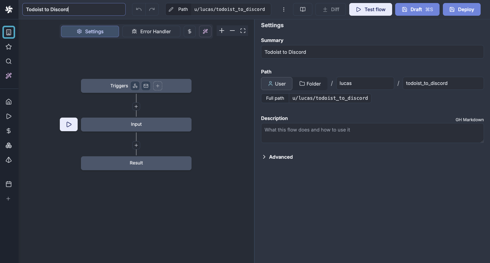

Click on the **Triggers** block at the top of the flow and select **Webhooks**. In the **Test trigger** block, copy the **Test URL**.

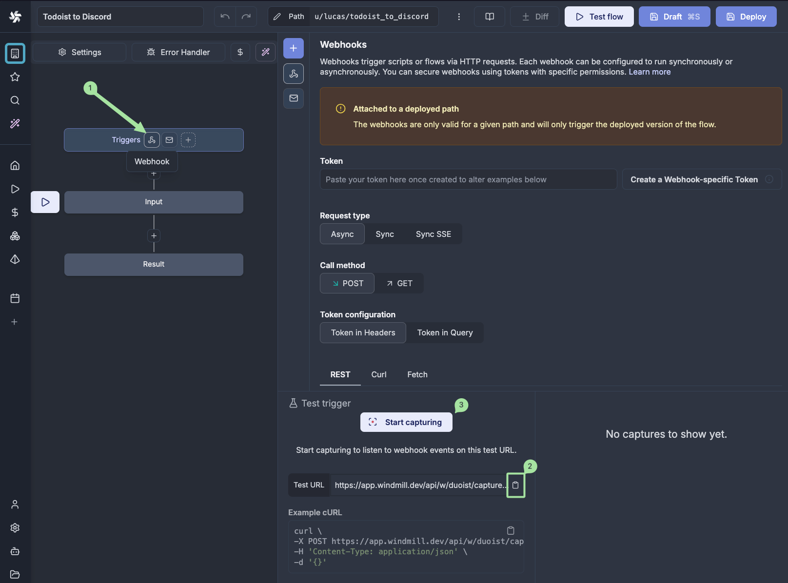

Paste this URL into your Todoist app's configuration as the **Callback URL**. Then click the **Activate webhook** button to save the change.

## Activating the webhook for personal use

According to the [Todoist documentation](https://developer.todoist.com/api/v1/#tag/Webhooks):

> Todoist webhooks don't fire by default for the user that has created the Todoist app, which is frequently the desired state for the personal use of webhooks.

Before our webhook will start generating events for actions made by our Todoist user, we need to complete the OAuth process for our new app.

Set the **OAuth redirect URL** for your Todoist app to `https://todoist.com/oauth/authorize` and click the **Save settings** button. Then navigate to the authorization request endpoint in your browser. This URL will look something like this:

```text
https://todoist.com/oauth/authorize?client_id=00000&scope=data:read&state=secretstring
```

> [!NOTE]
> Replace `00000` with the actual `client_id` for your Todoist app.

You'll see a page that looks like the following:

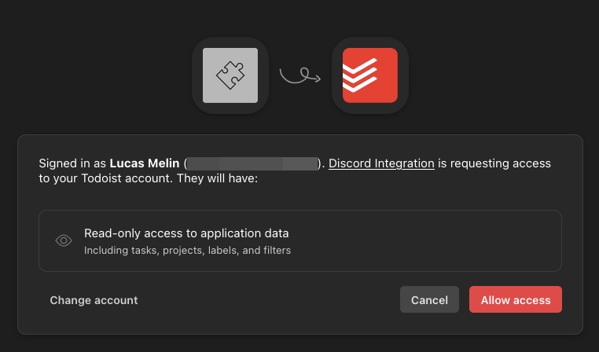

Click the **Allow access** button to continue. Your browser will redirect you to a page that will return a 404 due to an `ARGUMENT_MISSING` error, but your browser's URL should now contain a `code` query parameter. For example:

```text
https://todoist.com/oauth/authorize?code=AAAAA&state=secretstring
```

Using [`cURL`](https://curl.se/), we can now complete the token exchange using the `client_id` and `client_secret` values from our Todoist app configuration, and the `code` we just received:

```sh
curl "https://todoist.com/oauth/access_token" \
    -d "client_id=00000" \
    -d "client_secret=11111" \
    -d "code=AAAAA" \
    -d "redirect_uri=https://example.com"
```

> [!SUCCESS]
> When crafting the URL to use with cURL, make the following replacements:
> - `00000` with the `client_id` for your Todoist app
> - `11111` with the `client_secret` for your Todoist app
> - `AAAAA` with the `code` obtained in the previous step
>
> If you encounter an `invalid_grant` error, it's possible that your `code` expired. Try visiting the authorization request endpoint again to generate a new `code`.

If this is successful, the `curl` command will return JSON data that looks like the following:

```sh
{"access_token":"BBBBB","token_type":"Bearer"}%
```

Now that our webhook is properly authorized, we should start receiving events when we add or complete tasks in Todoist. Let's test that this works.

## Testing webhook in Windmill

In the **Triggers > Webhooks** section of our Windmill flow, we can click the **Start capturing** button to start listening to webhook events. Next, create a new task in Todoist to trigger a new `item:added` event.

Windmill will automatically capture and display the received webhook data. We can also use this captured data to test our flow by clicking the **Test flow with args** button. Right now, that button won't do much since we haven't created a script to read the data, but this will allow us to easily test our script as we work on it, without needing to constantly create new tasks in Todoist.

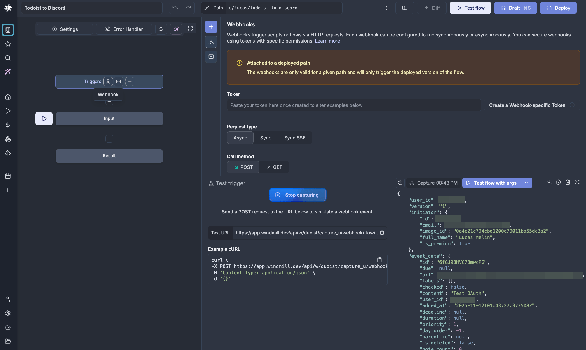

Click the **Stop capturing** button, and we'll move on to creating our script to parse this data.

## Building the script in Windmill

Our next step is to configure the inputs that our script will receive based on the JSON data received from Todoist. In the flow view in Windmill, click the **Input** box, and then click the **+** icon to add a new input.

The first input we want to retrieve from the JSON is the name of the event (whether it was an `item:added` or `item:completed` event). In the JSON, this has the key `event_name`, so we'll create a new input called `event_name`. Then click the **Add field** button.

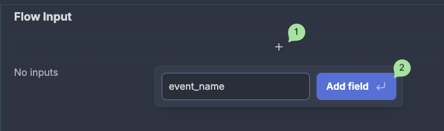

The other inputs we want to retrieve are the name of the task, and the task's URL, which will allow us to display the task name and a link to the task URL in our Discord message. These values are found in the `event_data` object in the JSON data, so we'll add a new input called `event_data`. After clicking the **Add field** button, change the **Type** to **Object**. We can then add our last two string inputs, `content` and `url`, as children of the `event_data` input using the **Object properties** field.

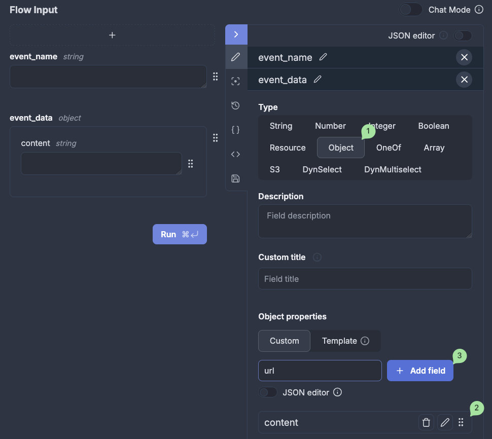

Before moving on to the next step, navigate back to **Triggers > Webhooks** and click the **Test flow with args** button again. If done correctly, all flow inputs should now show as populated with the correct data.


## Creating a Discord message

With our inputs now defined, we can create a script that will send a message to Discord. In the flow editor, click the **+** button after the **Input** block and choose **TypeScript (Bun)** to create a new script.

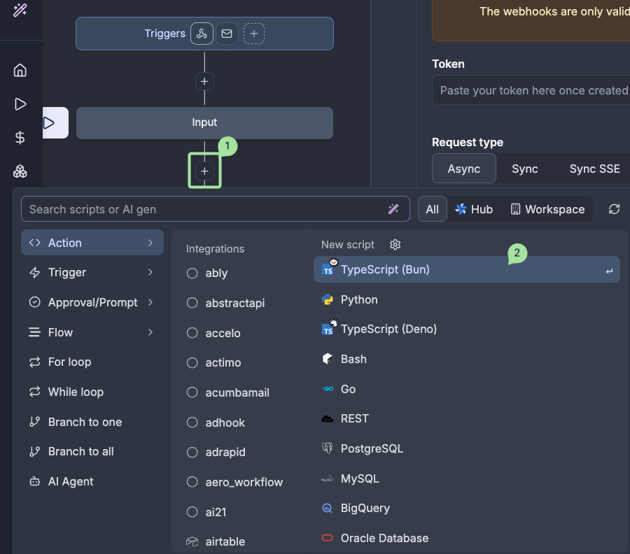

Rename the script summary to `Send to Discord`, then update the script so that it looks as follows:

```js
// import * as wmill from "windmill-client"
import fetch from "node-fetch";

export async function main(webhook_url: string, event_name: string, content: string, url: string) {
  if (event_name === "item:added") {
    await fetch(webhook_url, {
      method: "POST",
      headers: { "Content-Type": "application/json" },
      body: JSON.stringify(
        {
          username: "Todoist Bot",
          content: `📝 New Todoist task created: **${content}**`,
        }
      ),
    });
  } else if (event_name === "item:completed"){
    await fetch(webhook_url, {
      method: "POST",
      headers: { "Content-Type": "application/json" },
      body: JSON.stringify(
        {
          username: "Todoist Bot",
          content: `📝 Todoist task completed: [${content}](${url})`,
        }
      ),
    });
  }
}
```

This script will receive the inputs we defined previously and use them to determine content of the message that will be sent to Discord.

After updating the script, a few step input boxes will be displayed below our script. This lets us define what values should be passed as arguments to our function. Since we want the step input values to come from our _flow_ inputs, we can set the `event_name` input value to `flow_input.event_name`, the `content` input value to `flow_input.event_data.content`, and the `url` input value to `flow_input.event_data.url`.

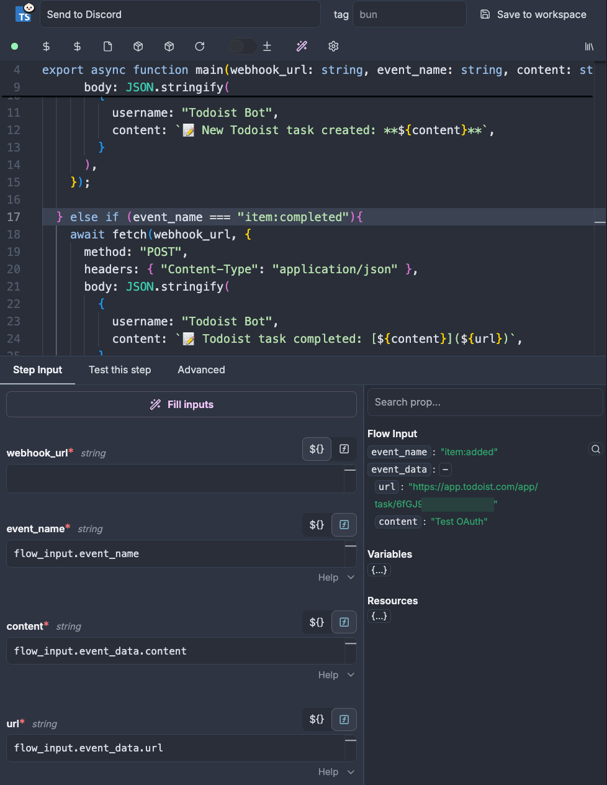

You might notice that there's one extra parameter to the `main` function that we didn't previously define as an input and which is currently blank, `webhook_url`. This is for the Discord webhook URL, which we haven't yet created. Let's do that next!

## Creating a Discord Webhook

In Discord, right-click on your server icon, and select **Server Settings > Integrations**. Click on **Webhooks** and then the **New Webhook** button. This will create a new webhook bot. Click on your bot (you can optionally change the name and channel), then click on the **Copy Webhook URL** button.

Switching back to Windmill, since our Discord Webhook URL is sensitive, we don't want to just paste it in the `webhook_url` step input. So let's save our current progress on our flow by clicking the **Draft** button in the top-right. Then click on the [**Variables**](https://app.windmill.dev/variables) button on the sidebar, and then click the **New variable** button.

Name the variable `discord_webhook`, and make sure that the **Secret** toggle is set to on. Then paste the Webhook URL in the **Variable** value box and click the **Save** button.

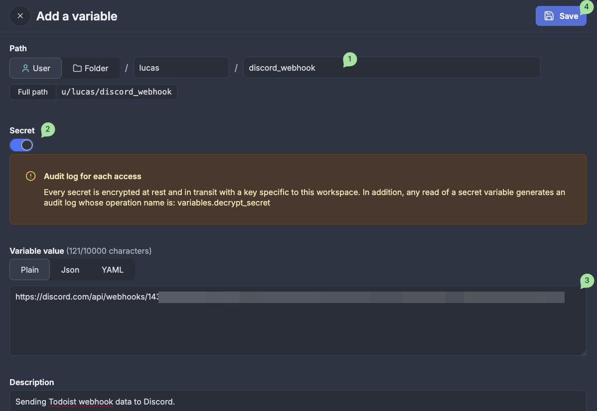

Navigate back to your flow and click the **Edit** button. Select the **Send to Discord** step and in the `webhook_url` step input field enter the full path to your variable (for example, `$var:u/lucas/discord_webhook`).

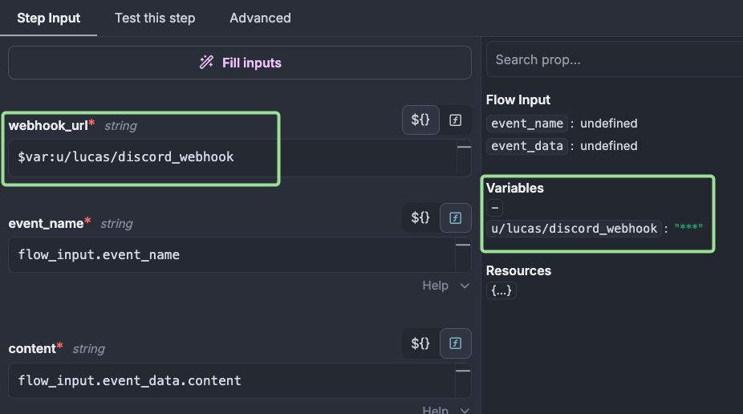

Test your flow again by navigating to **Triggers > Webhooks** and clicking the **Test flow with args** button. You should see a message displayed in Discord with information about the Todoist task you created.


## Publishing and securing our Windmill flow

Now that our flow has been created and is working, we can deploy our application. Click the **Deploy** button in the top-right corner to publish the flow.

Once our Windmill flow is published, we'll need to authenticate calls to our public URL using a token. Select the workflow and click the webhook icon on the **Triggers** block. Then, click the **Create a Webhook-specific Token** button. Leave the fields set to their defaults, and then click the **New token** button. This will generate a new authentication token which we can use to access our Windmill URL.

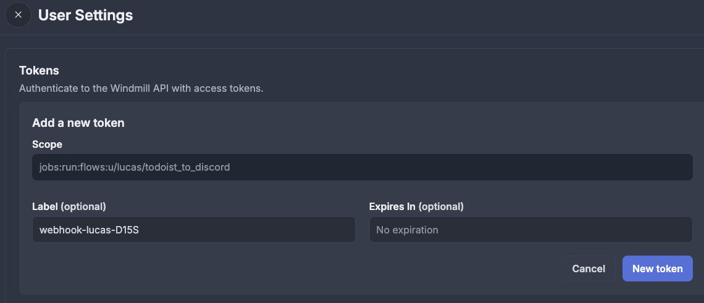

Under the **Token configuration** section, click the **Token in Query** button, and then copy the URL.

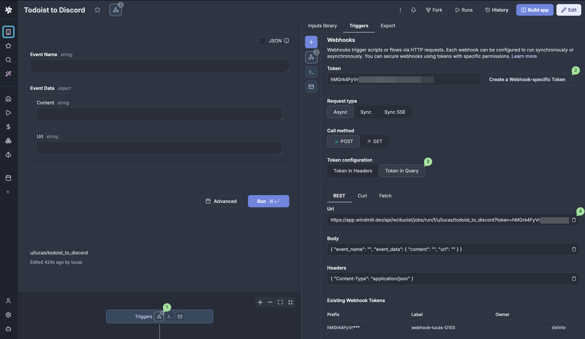

Tab back to the Todoist bot configuration, and paste this new URL into your Todoist app's configuration as the **Callback URL**. Then click the **Update webhook** button to save the change.

Finally, we can test that our completed setup is working as expected end-to-end by creating a new task in Todoist. This should automatically trigger a run of our flow in Windmill, and we should see a message show up in Discord.

Mark the task as completed to see another message show up in Discord indicating that the task is done. With that, we've successfully integrated Todoist with Discord using webhooks and Windmill. 🎉

## Next steps

This example is just scratching the surface of what we can do with a Todoist to Discord integration. If you want to try experimenting with this further, here are some follow-up ideas:

- Style the Discord message with a custom avatar by setting the `avatar_url` in the JSON payload, or add [custom embeds](https://birdie0.github.io/discord-webhooks-guide/structure/embeds.html).
- Add support for more types of webhook events like `item:updated` or `reminder:fired`. If you go this route, make sure to also update the webhook configuration of your Todoist app so that it includes the new event types.
- Configure multiple Discord webhook URLs, and parse out the project name so that Todoist tasks send messages to a specific channels based on the project.
