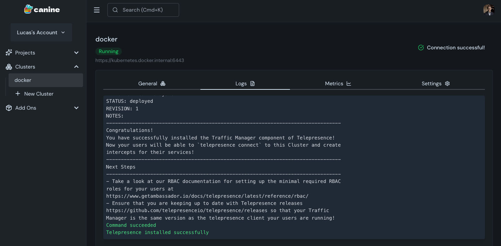

[canine: A Developer-friendly PaaS for your Kubernetes](https://canine.sh/) ([via](https://news.ycombinator.com/item?id=46307973#46308935)): I came across canine today, which is a open-source (Apache 2.0 License) deployment platform that runs on Kubernetes.

After running the installation script, I was able to login to the Web UI at http://localhost:3456, create an account, and add a GitHub Personal Access Token to the **Credentials** page.

Although the cluster setup only has options for configuring a Managed Kubernetes or Single VPS Installation (using k3s), I was able to get it connected to Kubernetes running via Docker Desktop by selecting the **Single VPS Installation** and providing `kubernetes.docker.internal` as the cluster IP Address. When prompted to provide the the output of `sudo cat /etc/rancher/k3s/k3s.yaml`, I pasted the contents of `cat ~/.kube/config > pbcopy` and was able to get through the rest of the configuration steps.

Deploying an application (or as Canine refers to it, a ["project"](https://docs.canine.sh/docs/basics/projects/)) was pretty straightforward as well. Configuring the GitHub repo, credentials to use, and service port was easily done through the web UI, and then Canine was able to build my container from my repository's Dockerfile, push the image to GitHub Packages, and successfully deploy my app to my Kubernetes cluster.