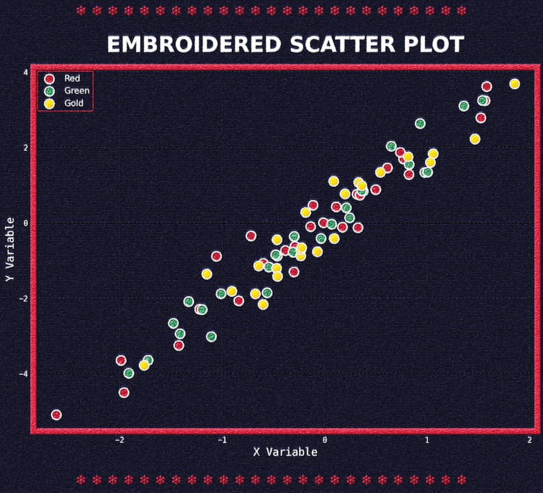

I came across [Aman Bhargava's post](https://aman.bh/blog/2025/creating-embroidered-charts-with-r-and-imagemagick) today showing how to make embroidered charts using R, and I found the look really appealing and eye-catching. I wanted a way to generate the same type of charts for myself, but I mostly do data analysis and charts in Python, not R. Ideally for my workflow, I'd be able to use this visual technique without needing to incorporate R into my data visualization pipeline.

Thankfully though, Aman has licensed his work under [CC BY-SA 4.0](https://creativecommons.org/licenses/by-sa/4.0/), so I was able to reimplement his technique in Python. This also uses the [embroidery ImageMagick script](http://www.fmwconcepts.com/imagemagick/embroidery/) by Fred Weinhaus. The source code for my implementation is available at [https://github.com/lucasmelin/embroidery](https://github.com/lucasmelin/embroidery).

I really like how the charts turn out with this effect, here's a couple of examples.

